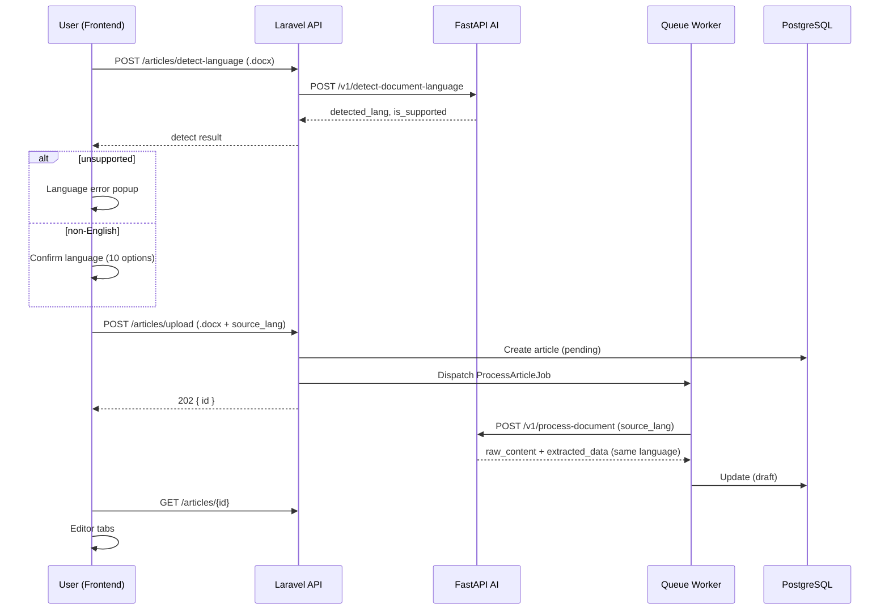

# Phase 1: Core AI Loop

**Status:** ✅ Complete  
**Scope:** Pre-interview task (~4h) — upload → AI → editor loop  
**Dependencies:** None

---

## Goals

Build the core AI loop: upload `.docx` (+ images) → detect language → queue processing → magazine article (same language as source) → editor with source mapping. Multilingual website + landing page.

---

## Implementation checklist

### Docker infrastructure
- [x] Docker Compose: Next.js, Laravel API, Queue Worker, FastAPI, PostgreSQL, Redis
- [x] PostgreSQL/Redis healthchecks, volume persistence
- [x] `.dockerignore` for backend, frontend, ai-service
- [x] Entrypoint auto migrate + seed on startup

### Backend — Laravel 11
- [x] Migration `users` (role, provider, provider_id)
- [x] Migration `articles` (JSONB, document_path, image_paths, error_message, **source_lang**)
- [x] Seeder with 3 mock accounts (Admin / Editor / Author)
- [x] Sanctum Bearer token auth
- [x] CORS for frontend origin
- [x] API endpoints (auth, articles CRUD, upload, status, images, **detect-language**)
- [x] `ProcessArticleJob` — `ai-processing` queue, passes `source_lang` to AI
- [x] `ArticlePolicy` + IDOR scoping by role
- [x] Store image metadata `{ path, filename }`
- [x] `SupportedContentLanguageCodes` — 10 languages (aligned with flashcard)
- [x] `AiLanguageDetectClient` → FastAPI detect

### AI Service — FastAPI
- [x] `POST /v1/process-document` (+ `source_lang` → output in same language)
- [x] `POST /v1/detect-language` — text
- [x] `POST /v1/detect-document-language` — `.docx` → parse → detect (`langdetect` + script heuristics)
- [x] `python-docx` → Raw Chunks with `index`
- [x] Pydantic `TravelMagazineSchema`
- [x] LLM: OpenAI / Gemini / mock fallback
- [x] System prompt anti-hallucination + magazine style + **output language instruction**
- [x] Boundary check for `sources` and `suggested_images`
- [x] Multimodal: images with docx

> AI technical details: [ai-service-spec.md](../ai-service-spec.md)

### Frontend — Next.js 14
- [x] **Landing page** `/` — layout inspired by [Meetutor](https://meetutor.com/) / flashcard frontend (hero, features, FAQ, CTA)
- [x] **i18n** — 10 locales (`scripts/i18n/translations/*.json`), LanguageProvider + selector
- [x] Login `/login` — quick login for 3 roles
- [x] Upload `/upload` — drag & drop `.docx`, multi-image
- [x] **Detect language** before upload → error popup if unsupported
- [x] **Confirm language** if file ≠ English (choose among 10 languages)
- [x] Processing `/processing/{id}` — 3-second polling
- [x] Dashboard `/dashboard` — list by role
- [x] Editor `/editor/{id}` — full-width tabs (Original Notes · Article · Edit)
- [x] Source highlight + Source drawer
- [x] Magazine preview + inline images (max 3) + carousel (>3 images)
- [x] `AuthImage` — load images via API with Bearer token

---

## End-to-end flow

---

## Supported languages (UI + content)

`en`, `vi`, `ja`, `ko`, `zh-cn`, `th`, `id`, `es`, `fr`, `de`

Translation files: [scripts/i18n/translations/](../../scripts/i18n/translations/)

---

## API endpoints (Phase 1)

| Method | Endpoint | Description |
|--------|----------|-------------|
| POST | `/api/v1/auth/login` | Mock login |
| GET | `/api/v1/auth/me` | Current user |
| POST | `/api/v1/auth/logout` | Revoke token |
| GET | `/api/v1/articles` | List (by role) |
| POST | `/api/v1/articles/detect-language` | Detect language from `.docx` |
| POST | `/api/v1/articles/upload` | Upload docx + images + `source_lang` |
| GET | `/api/v1/articles/{id}/status` | Polling |
| GET | `/api/v1/articles/{id}` | Detail + images[] |
| GET | `/api/v1/articles/{id}/images/{index}` | Serve image |
| PUT | `/api/v1/articles/{id}` | Update article |

---

## Notes / known limits

- Mock auth (Sanctum token); Social Login planned for Phase 3
- No Submit / Approve / Reject workflow yet
- `.docx` only (PDF/OCR → Phase 2)
- Gemini schema must be inline (no Pydantic `$defs`)
- Some Laravel API error messages may remain in English

---

[← Back to master plan](../project-master-plan.md) · [Phase 2 →](./phase-2-document-intelligence.md)
